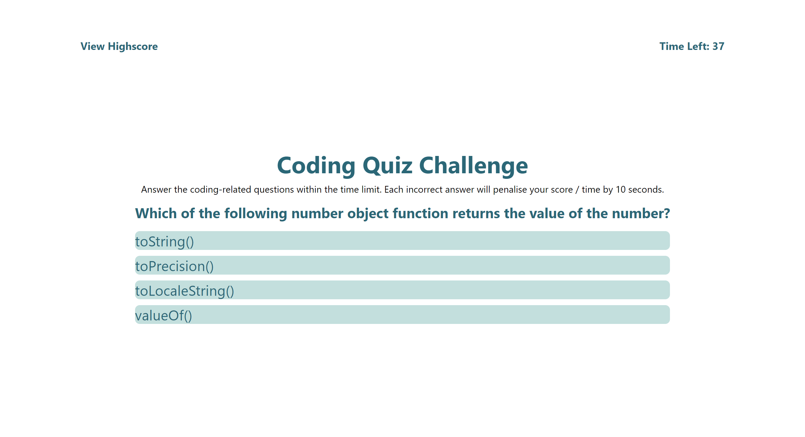

## Multiple-choice quiz using HTML, CSS and Javascript

## Output
A timed coding quiz with multiple-choice questions. This app  runs in the browser and features dynamically updated HTML and CSS powered by JavaScript code. It has a clean, polished, and responsive user interface. 

## Deployed page: 
https://amirene.github.io/code_quiz/




## User Story

```
AS A coding boot camp student
I WANT to take a timed quiz on JavaScript fundamentals that stores high scores
SO THAT I can gauge my progress compared to my peers
```

## Acceptance Criteria

```
GIVEN I am taking a code quiz
WHEN I click the start button
THEN a timer starts and I am presented with a question
WHEN I answer a question
THEN I am presented with another question
WHEN I answer a question incorrectly
THEN time is subtracted from the clock
WHEN all questions are answered or the timer reaches 0
THEN the game is over
WHEN the game is over
THEN I can save my initials and my score
```

## Logic used to create the quiz

1. When the user clicks start, the timer starts and the questions and answers appear on screen.
2. Questions are randomised in order and with each refresh of the browser or if the user wishes to play again - the order of the question changes.
3. Each incorrect answer results in a score / time penalty of 10 seconds (timer decrements for each wrong answer)
4. Each correct answer gets 20 points (high score = 100 points)

5. Quiz ends EITHER when: 
    * When timer hits zero OR
    * When user finishes all the questions within time limit
6. When quiz ends, the user is asked to submit their score and enter initials in a form.
7. These scores are saved in a second html page called high scores. 


## Wireframe

https://docs.google.com/presentation/d/1vjbGfGn-aSUaqKEtsBUEpCwZSq3uyx9oEc95neVfRpc/edit?usp=sharing